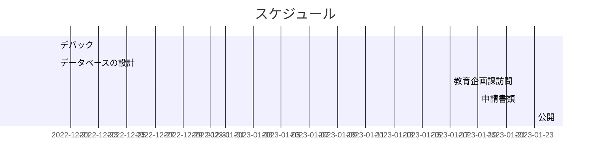

# flask を使用したwebアプリの開発

## デモ
[Pythonanywhere](https://naokey.pythonanywhere.com/)

## 仮想環境の構築

新しい環境の作成
```
python -m venv venv
```

仮想環境のアクティブ化
```
venv\Scripts\activate
```

仮想環境の非アクティブ化
```
deactivate
```

## プログラムの構成

```
.
├── templates
│   ├── template.html
│   ├── index.html
│   ├── show_all.html
│   ├── result.html
│   ├── page_not_found.html
│   └── road_network.html
├── static
│   ├── tablesort.css
│   ├── tablesort.js
│   ├── icon, tag, etc.
│   ├── image
│   └── road_network.graphml
├── main.py
├── create_map.py
├── MapData.py
└── db.sqlite3
```

### サーバサイド
- Python
  - Flask
  - osmnx, folium, networkx

### フロントエンド
- HTML/CSS
    - JavaScript(jQuery)
- BootStrap

### データベース
- sqlite3
- SQLAlchemy


## 備忘録
### Pythonanywhere
#### 注意点
パスが通らないことがある
`mysite`の下に通すと上手くいく
`flask_app.py`のデータベースのパスを次のように変更
```python
engine = create_engine('sqlite:///mysite/test.sqlite3')
```
`create_map.py`の74行目を次のように変更
```pyhton
folium_path_outfile = "mysite/templates/road_network.html"
```

#### コマンド(Buch console)
packageの追加
```
pip3.10 install --user package
```

容量の確認
```
du -hs /tmp ~/.[!.]* ~/* | sort -h
```

## 今後の展望

- 表示の拡張(データベースの再構築)
  - 開講ターム（前期・後期）
  - 対称学部・学科
  - 学年
- 検索機能の充実
  - 時間割から検索
  - 教室名から検索
  - 教員名検索（余裕があれば）
- 地図
  - 図書館や学食等を追加
  - 右左折の表示
  - ノード・エッジの追加
- その他
  - 入りにくい教室のピックアップ
    - システムデザイン演習室
    - 全学1-401
  - 英語版

## 参考

- [【無料サーバーのご紹介】Pythonanywhere](https://blog.codecamp.jp/programming-free-server-1)
- [【Python】Flask入門　Flask-SQLAlchemyの使い方](https://shigeblog221.com/flask-sqlalchemy/)
- [Flask公式ドキュメントの和訳](https://msiz07-flask-docs-ja.readthedocs.io/ja/latest/quickstart.html)
- テーブルのソート(jQuery) : [Qiita](https://qiita.com/fromage-blanc/items/94b90e2b9431884ad6fc)
- JS 正規表現 : [Qiita](https://qiita.com/iLLviA/items/b6bf680cd2408edd050f)
- Flask urlのデータ : [webサイト](https://www.web-dev-qa-db-ja.com/ja/python/flask%E3%83%AA%E3%82%AF%E3%82%A8%E3%82%B9%E3%83%88%E3%81%AEurl%E3%81%AE%E3%81%95%E3%81%BE%E3%81%96%E3%81%BE%E3%81%AA%E9%83%A8%E5%88%86%E3%82%92%E5%8F%96%E5%BE%97%E3%81%99%E3%82%8B%E3%81%AB%E3%81%AF%E3%81%A9%E3%81%86%E3%81%99%E3%82%8C%E3%81%B0%E3%82%88%E3%81%84%E3%81%A7%E3%81%99%E3%81%8B%EF%BC%9F/1072136546/)
- Flask フラッシュメッセージ : [Flask 公式サイト](https://msiz07-flask-docs-ja.readthedocs.io/ja/latest/patterns/flashing.html)
- VSCode SQLite Browser : [Qitta](https://qiita.com/ritya/items/098835a96f3fcf7c6661)
- 


